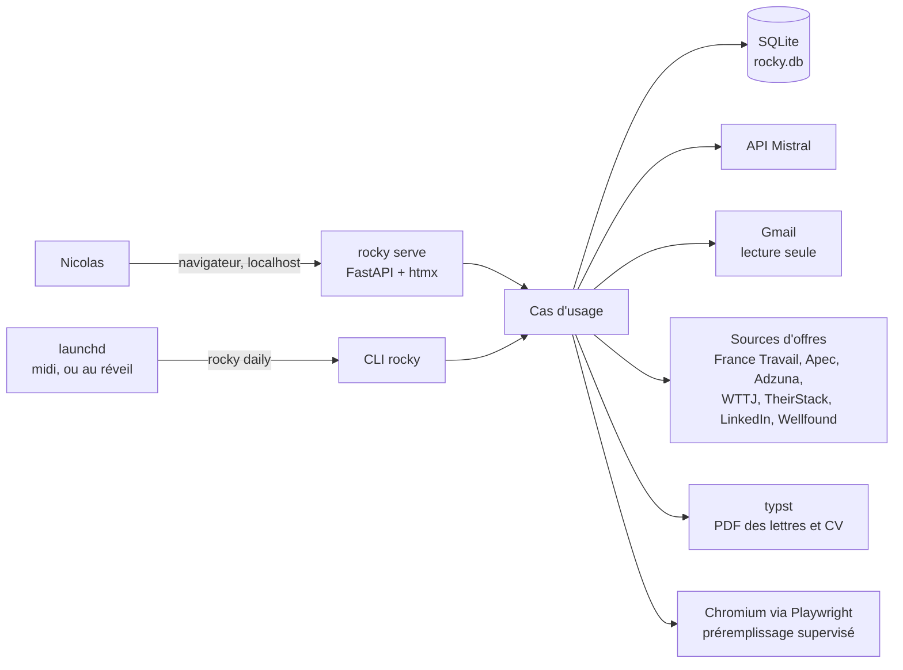
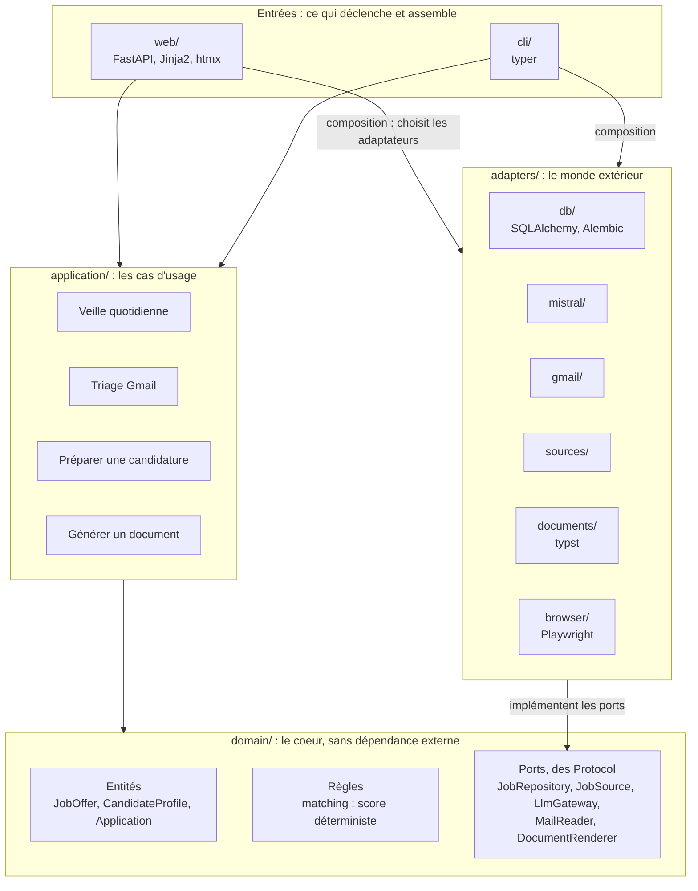
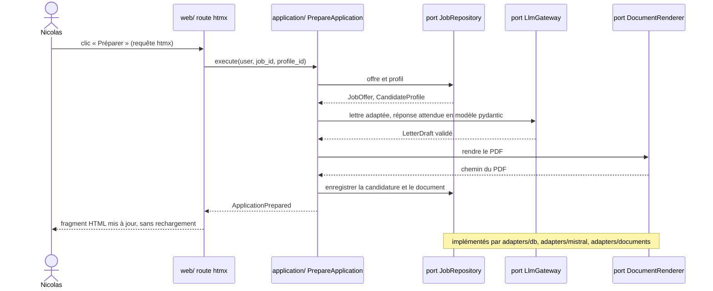
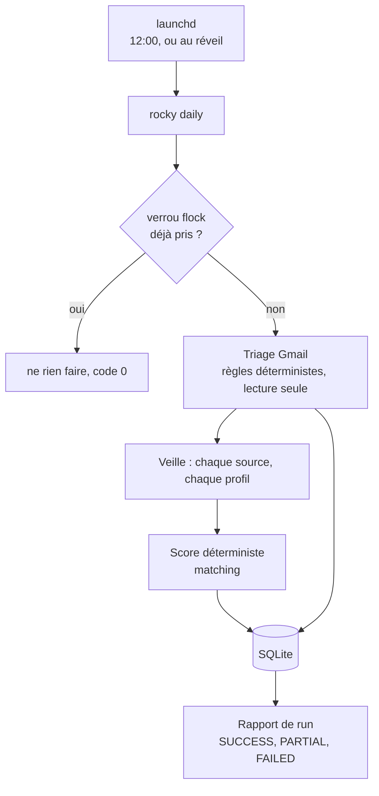
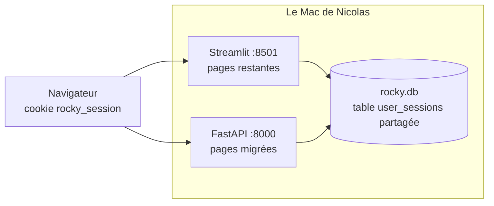

# Architecture cible de Rocky

Ce document dessine la cible décidée dans les ADR 0005 à 0013
(`docs/decisions/`). Le code actuel, dans `dashboard/`, ne la suit pas
encore : la migration se fait fonctionnalité par fonctionnalité (ADR 0013).

## Comment lire ces schémas

Les schémas sont écrits en Mermaid, un texte que beaucoup d'outils savent
dessiner :

- Sur GitHub, ouvrir ce fichier : les schémas s'affichent directement.
- Dans VS Code, ouvrir l'aperçu Markdown (`Cmd+Shift+V`) avec l'extension
  « Markdown Preview Mermaid Support ».
- Avec Claude Code, demander « publie docs/architecture.md en artifact » :
  la page web rend les schémas.
- Avec Codex ou tout autre agent, demander « explique-moi le schéma des
  couches dans docs/architecture.md » : le schéma est du texte, l'agent le
  lit tel quel.
- Pour retoucher un schéma sans rien installer, coller son bloc sur
  https://mermaid.live.

## 1. Vue d'ensemble : qui parle à quoi

Tout tourne sur le Mac de Nicolas (ADR 0005). Deux points d'entrée : le
navigateur et `launchd`.

## 2. Les couches et le sens des dépendances

C'est le schéma à connaître par coeur (ADR 0008). Les flèches pleines sont
des imports autorisés. Toute flèche dans l'autre sens est une erreur, et
`lint-imports` la refuse.

Les cinq règles, dans l'ordre d'importance :

1. `domain/` n'importe rien d'externe : ni SQLAlchemy, ni FastAPI, ni httpx,
   ni le SDK Mistral.
2. `application/` ne connaît que `domain/`. Il reçoit les adaptateurs par
   injection, sous la forme des ports.
3. `adapters/` implémentent les ports et ne s'importent jamais entre eux.
4. `web/` et `cli/` sont les seuls endroits qui assemblent le tout.
5. Avant de commiter : `lint-imports`, `ruff check`, `pytest`.

## 3. Un parcours complet : préparer une candidature

Le même chemin vaut pour tous les cas d'usage : la route ne fait que
traduire la requête, le cas d'usage orchestre, les ports isolent le monde
extérieur.

## 4. Le cycle quotidien

`launchd` lance `rocky daily` à midi, ou au réveil si l'heure est passée
pendant le sommeil du portable (ADR 0012). Le verrou empêche deux
exécutions en même temps.

## 5. La transition depuis Streamlit

Pendant la migration, les deux applications tournent côte à côte sur deux
ports de `localhost`. Le cookie de session ignore le port : la même table
`user_sessions` sert aux deux (ADR 0006). Chaque lot migre une
fonctionnalité en entier et supprime la page Streamlit correspondante.

## 6. Où va le code actuel

| Aujourd'hui | Cible |
|---|---|
| `dashboard/rocky/matching.py`, `language.py`, règles de `gmail_service.py` | `domain/` |
| `dashboard/rocky/models.py` (dataclasses) | `domain/` entités |
| `dashboard/rocky/repository.py`, SQL de `auth.py` | `adapters/db/` |
| `dashboard/rocky/auth.py` (hachage, sessions, verrouillage) | `domain/` et `application/`, conservé |
| `dashboard/rocky/llm.py` | `adapters/mistral/` et cas d'usage dans `application/` |
| `dashboard/rocky/gmail_service.py` (lecture) | `adapters/gmail/` |
| `dashboard/rocky/sources/` | `adapters/sources/` |
| `letters.py`, `profile_documents.py`, `cv_tailoring.py` | `adapters/documents/` (typst) et `application/` |
| `browser_apply.py`, `scripts/prefill_application.py` | `adapters/browser/` |
| `dashboard/page_*.py`, `dashboard_v2.py` | `web/` routes et templates |
| `scripts/*.py` | `cli/` |
| `scheduler.py`, `cron/` | deux plists `launchd` |
