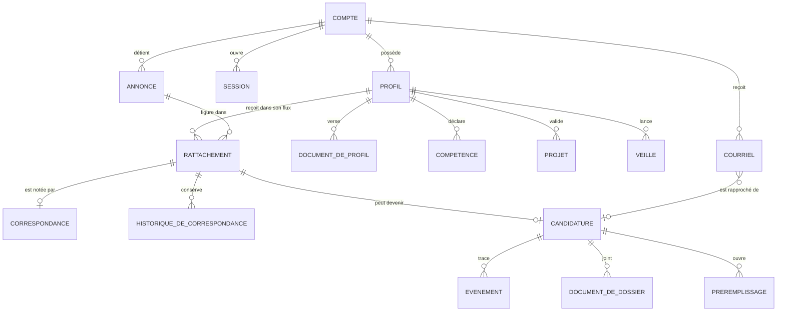
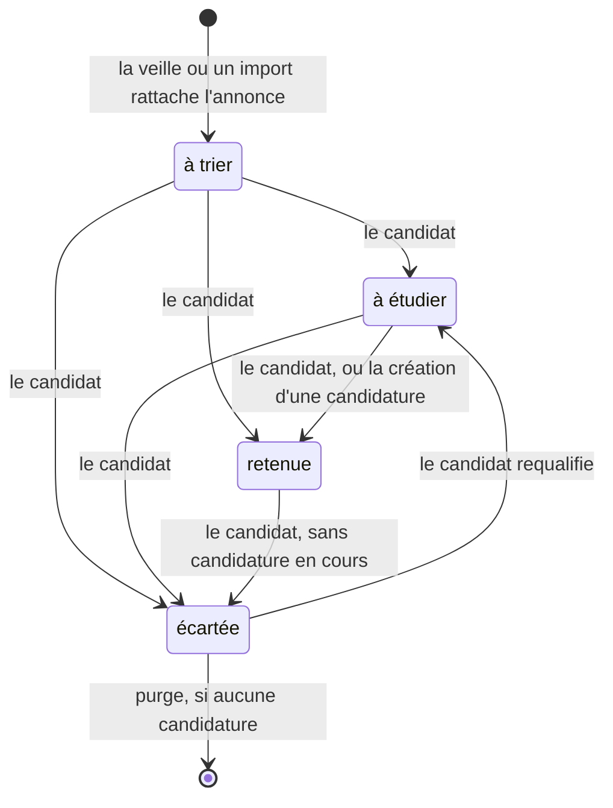
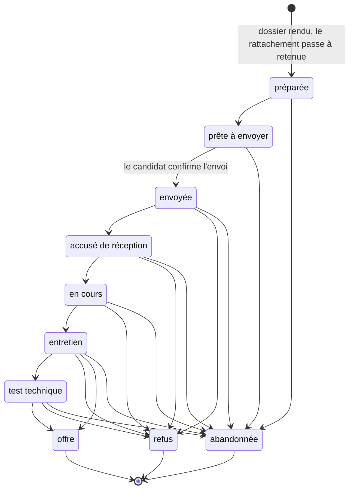
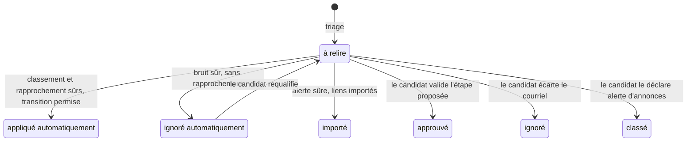
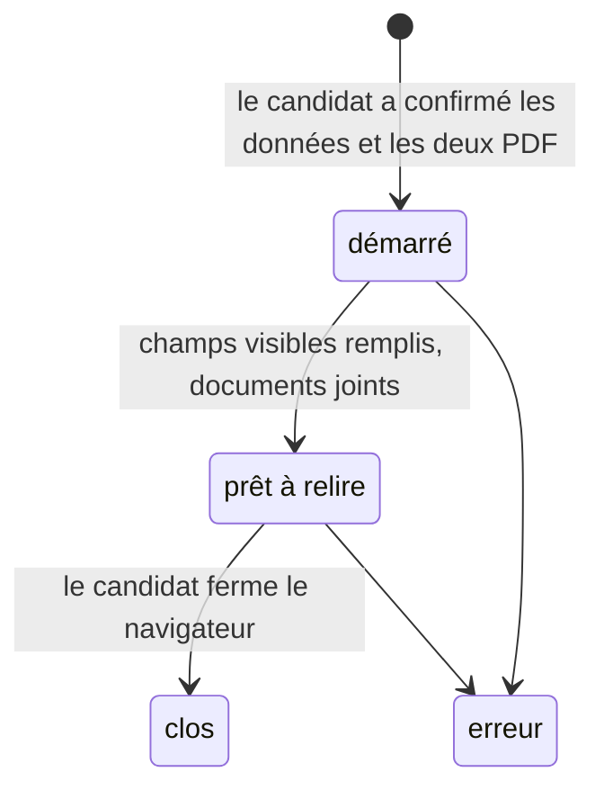
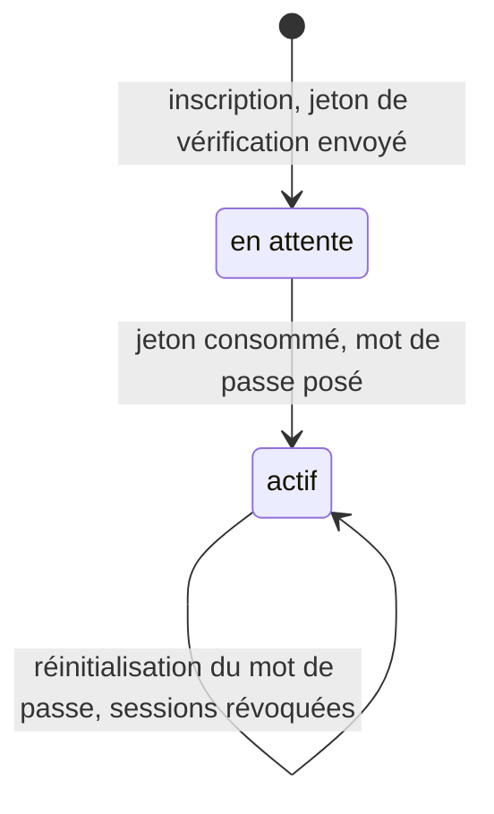
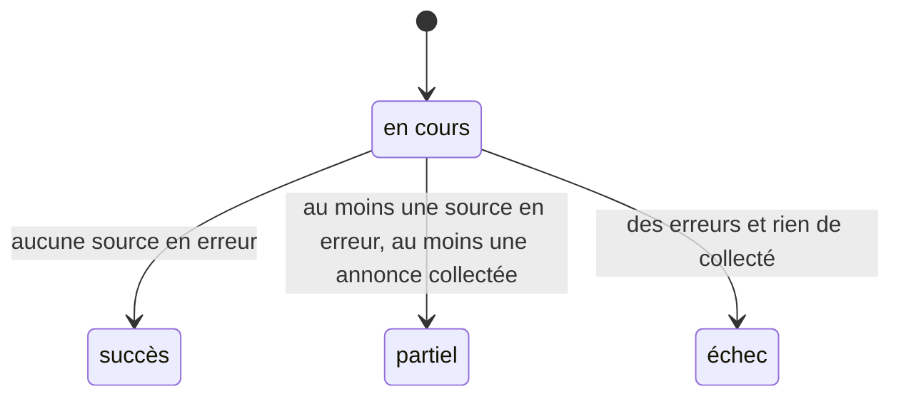

# Modèle de domaine de Rocky

Les termes sont définis dans `CONTEXT.md`, à la racine. Ce document montre
comment ils se relient, quels états existent et qui a le droit de les
changer. Il décrit la cible (ADR 0014) et dit à chaque fois ce que le code
actuel fait de différent. Les schémas se lisent comme ceux de
`docs/architecture.md`.

## 1. Les entités et leurs liens

Trois liens portent l'essentiel du modèle :

1. **Rattachement** : une annonce est unique et partagée ; ce qu'un profil en
   pense (sa décision) vit sur le rattachement, pas sur l'annonce.
2. **Correspondance** : une note par couple profil-annonce, recalculable ;
   chaque calcul est ajouté à l'historique avec la version du barème.
3. **Candidature** : au plus une par couple profil-annonce ; elle naît d'un
   rattachement retenu et porte son propre cycle.

## 2. L'annonce : trois faits, une décision

Aujourd'hui une seule colonne `job_offers.status` mélange neuf valeurs :
`NOUVELLE`, `ANCIENNE`, `INCOMPLÈTE`, `À ÉTUDIER`, `RETENUE`, `ÉCARTÉE`,
`CANDIDATURE ENVOYÉE`, `ENTRETIEN`, `REFUS`. La cible sépare :

| Aujourd'hui | Cible | Nature |
|---|---|---|
| `NOUVELLE`, `ANCIENNE`, `ÉCARTÉE` par ancienneté | **Fraîcheur** : nouvelle, ancienne, expirée | Se déduit de la date de publication, jamais stockée |
| `INCOMPLÈTE` et le booléen `description_is_full` | **Complétude** : complète, incomplète | Un seul fait |
| `À ÉTUDIER`, `RETENUE`, `ÉCARTÉE` par le candidat | **Décision** du rattachement : à trier, à étudier, retenue, écartée | Propre à chaque profil |
| `CANDIDATURE ENVOYÉE`, `ENTRETIEN`, `REFUS` | Lue sur la candidature | Plus jamais recopiée sur l'annonce |

Règles :

- La fraîcheur ne s'écrit pas : une annonce expirée encore « à trier » sort
  du flux par simple filtre. Aujourd'hui une politique nocturne réécrit
  `ANCIENNE` puis `ÉCARTÉE` sur les annonces restées `NOUVELLE`.
- La correspondance n'est calculée que sur une annonce complète.
- Modifier une annonce à la main la rend complète ; aujourd'hui ce passage
  `INCOMPLÈTE → NOUVELLE` est un effet de bord d'un formulaire.

## 3. La candidature : dix étapes ordonnées

Règles, dans l'ordre :

1. Une étape terminale (offre, refus, abandonnée) ne bouge plus, sauf par
   annulation.
2. Un automatisme (Gmail, assistant) ne fait jamais reculer une candidature :
   l'étape proposée doit être au moins aussi avancée que l'étape courante, ou
   terminale. Aujourd'hui cette garde n'existe que sur le chemin Gmail ; les
   cinq écritures depuis l'interface la contournent.
3. Un retour en arrière humain est une annulation du dernier événement, tracée
   comme événement d'origine « annulation ». Il n'existe pas d'autre chemin.
4. Chaque changement d'étape produit un événement avec son origine et, pour
   un automatisme, sa confiance. Les événements ne s'effacent jamais.
5. La date d'envoi est posée une seule fois, au passage à « envoyée ».

Correspondance avec les valeurs actuelles : `DOSSIER PRÉPARÉ`, `PRÊTE À
ENVOYER`, `CANDIDATURE ENVOYÉE`, `ACCUSÉ DE RÉCEPTION`, `EN COURS`,
`ENTRETIEN`, `TEST TECHNIQUE`, `OFFRE`, `REFUS` gardent leur sens ;
`ÉCARTÉE` devient **abandonnée** ; `RETIRÉE` n'existe que dans une clause
d'exclusion et disparaît.

## 4. Le courriel : classement, rapprochement, traitement

Le triage est déterministe. Un courriel reçoit un classement avec une
confiance, puis un rapprochement éventuel avec une candidature (nom de
l'employeur seul), puis un traitement.

| Classement | Étape proposée | Confiance |
|---|---|---|
| offre | offre | 0,99 |
| refus | refus | 0,98 |
| test technique | test technique | 0,97 |
| entretien | entretien | 0,96 |
| accusé de réception | accusé de réception | 0,94 |
| en cours | en cours | 0,92 |
| alerte d'annonces | aucune | 0,96 |
| retour de candidature | aucune | 0,78 |
| bruit | aucune | 0,96 |

Règles :

- « Sûr » veut dire strictement au-dessus de 0,95 pour appliquer, de 0,90
  pour ignorer. La confiance retenue est la plus basse du classement et du
  rapprochement. Un accusé de réception ou un « en cours » ne s'applique donc
  jamais seul : il attend le candidat.
- Un classement manuel est définitif pour le triage.
- Le corps du courriel n'est jamais conservé ; son contenu n'est jamais une
  instruction.
- Aujourd'hui les valeurs `PENDING` et `UNKNOWN` existent en base sans que le
  code les écrive : elles disparaissent, « à relire » est l'état initial.

## 5. Le préremplissage supervisé

Rocky ne cherche jamais le bouton d'envoi et ne clique jamais dessus : le
passage à « envoyée » de la candidature reste une confirmation du candidat.

## 6. Le compte

Le verrouillage n'est pas un état du compte mais une fenêtre de quinze
minutes après cinq échecs consécutifs ; un succès ou une réinitialisation la
lève. Les réponses publiques sont identiques que l'adresse existe ou non.

## 7. La veille

Chaque source a son propre résultat, réussi ou en erreur, avec ses compteurs.
Une plateforme qui refuse la lecture automatisée est une source en erreur ;
la veille reste partielle, jamais contournée.

## 8. Invariants

1. Un compte a au plus un profil actif.
2. Une annonce est unique par source et identifiant externe ; elle n'est
   jamais dupliquée par profil.
3. Au plus une candidature par couple profil-annonce.
4. La correspondance est déterministe et versionnée ; son historique ne se
   réécrit pas.
5. Toute transition d'annonce ou de candidature passe par le domaine, avec
   ses gardes ; aucune interface n'écrit un état directement.
6. Le corps d'un courriel n'est jamais stocké ; Gmail reste en lecture seule.
7. Rocky ne soumet jamais une candidature.

## 9. Ce qui disparaît du code actuel

- Les trois copies de la liste des étapes « envoyée ou plus » dans
  l'interface ; la cible expose un seul ensemble ordonné.
- La table de projection « étape de candidature vers statut d'annonce »
  (`APPLICATION_TO_JOB_STATUS`) : l'annonce ne porte plus l'avancement.
- Les trois colonnes à valeur unique `ready` (`profile_documents.status`,
  `profile_analyses.status`, `profile_localizations.translation_status`) et
  la fonction sans appelant qui devait les faire changer.
- Les deux vocabulaires de noms de sources (`Apec` contre `APEC`) : un seul
  nom par source, porté par le domaine.
- Les trois exemplaires de `matching-v1` : la version du barème vit avec le
  barème.
